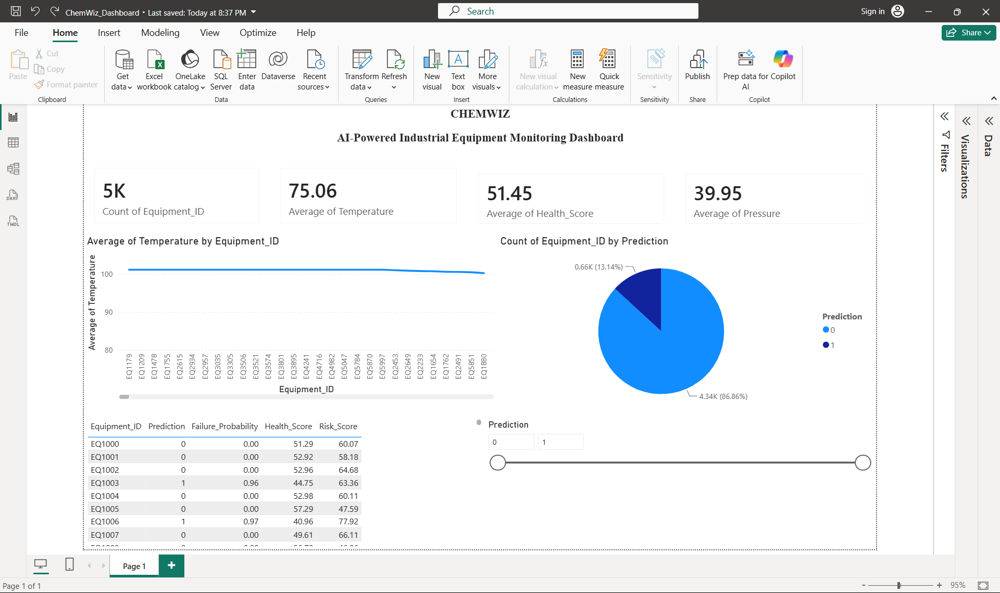

# ChemWiz – AI-Powered Industrial Equipment Monitoring Dashboard

## Overview

ChemWiz is an AI-powered predictive maintenance and industrial equipment monitoring system developed using Python and Power BI. The project simulates industrial equipment sensor data, preprocesses it, predicts equipment failures using a Machine Learning model, and visualizes insights using an interactive Power BI dashboard.

---

## Features

- Industrial equipment monitoring
- Synthetic sensor data generation
- Data preprocessing using Pandas
- Health Score & Risk Score calculation
- Random Forest based failure prediction
- Interactive Power BI Dashboard
- KPI Monitoring
- Failure Distribution Analysis

---

## Technologies Used

- Python
- Pandas
- NumPy
- Scikit-learn
- Power BI

---

## Dashboard Preview



---

## KPIs

- Total Equipment
- Average Temperature
- Average Pressure
- Average Health Score

---

## Machine Learning

- Random Forest Classifier
- Predictive Maintenance
- Failure Prediction

---

## Project Structure

```text
ChemWiz/
├── chemwiz.py
├── processed_data.csv
├── predictions.csv
├── ChemWiz_Dashboard.pbix
├── requirements.txt
├── README.md
└── images/
    └── dashboard.png
```

---

## Future Scope

- IoT Sensor Integration
- Real-time Monitoring
- Cloud Deployment
- Predictive Maintenance Alerts

---

## Author

Sagar Malgave
